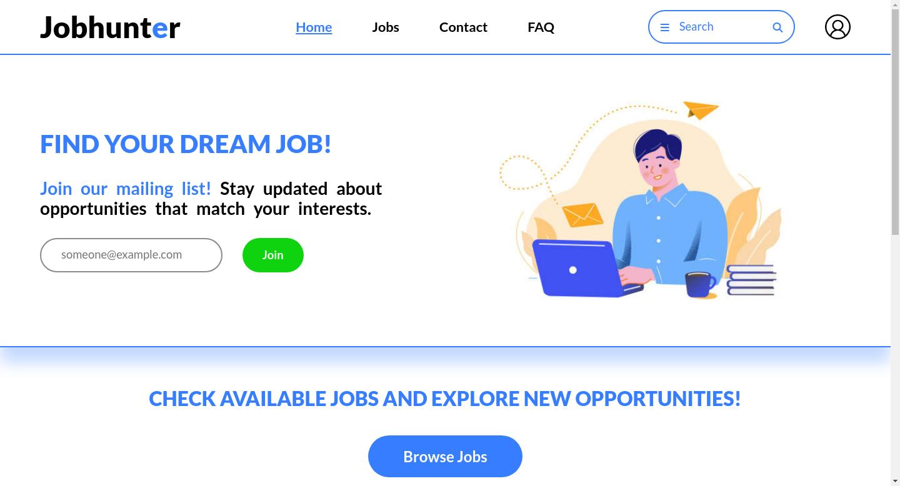

# JOBHUNTER

## Welcome! 👋

This web ui is done using HTML and CSS only which will help you understand the basics of HTML & CSS including CSS variables, CSS Flex, CSS Grid and CSS media queries.

## Tech Stack

**Client:** HTML, CSS

## Deployment

Deploy this project on Github Pages / Vercel / Netlify.

**Live URL:** https://priyanshusharma0326.github.io/jobhunter/